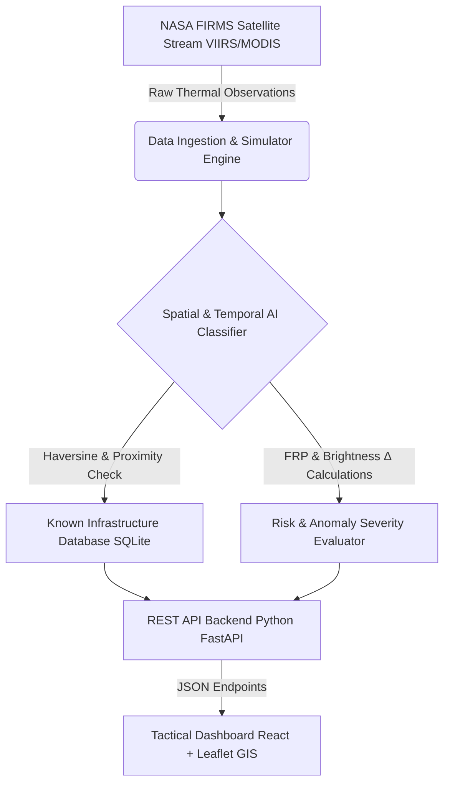

# 🔥 Thermal Hotspot AI — Orbital Intelligence Dashboard

<p align="center">
  
</p>

<p align="center">
  <b>A Full-Stack Satellite Thermal Anomaly & Wildfire Intelligence System</b><br>
  Powered by NASA FIRMS (VIIRS/MODIS), Spatial Persistence Algorithms, Infrastructure Proximity Mapping, and Multi-Class AI Anomaly Classification.
</p>

<p align="center">
  <a href="https://python.org"></a>
  <a href="https://reactjs.org"></a>
  <a href="https://www.typescriptlang.org/"></a>
  <a href="https://tailwindcss.com"></a>
  <a href="https://vercel.com"></a>
  <a href="LICENSE"></a>
</p>

---

## ⚡ Core Capabilities & Highlights

<table width="100%">
  <tr>
    <td width="50%" valign="top">
      <h3>🛰️ Orbital Intelligence & NASA FIRMS Sync</h3>
      <ul>
        <li><b>Live Satellite Stream</b>: Direct integration with NASA FIRMS (VIIRS NRT & MODIS) thermal detection satellite feeds.</li>
        <li><b>High-Fidelity Simulator</b>: Built-in synthetic satellite stream pass generator covering global industrial clusters and risk zones.</li>
        <li><b>Telemetry Analytics</b>: Evaluates Fire Radiative Power ($FRP$), Brightness Temperatures ($TI_4 / TI_5$), and confidence intervals.</li>
      </ul>
    </td>
    <td width="50%" valign="top">
      <h3>🤖 AI Classification Engine</h3>
      <ul>
        <li><b>Multi-Class Categorization</b>: Distinguishes between <i>Industrial Fires, Gas Flaring, Wildfires, Agricultural Burning</i>, and <i>Mining Thermal Activity</i>.</li>
        <li><b>Spatial & Temporal Clustering</b>: Uses Haversine distance, OpenStreetMap proximity, and multi-pass persistence counting.</li>
        <li><b>Explainable AI (XAI)</b>: Human-readable diagnostic reasoning chains for every anomaly signature.</li>
      </ul>
    </td>
  </tr>
  <tr>
    <td width="50%" valign="top">
      <h3>🗺️ Tactical GIS Web Dashboard</h3>
      <ul>
        <li><b>Interactive Leaflet GIS Map</b>: Dynamic heatmaps, satellite imagery tiles, vector markers, and thermal pulse animations.</li>
        <li><b>Midnight-Blue Cosmic UI</b>: Sleek, high-density tactical interface designed for mission control and operations centers.</li>
        <li><b>Real-Time Signal Filtering</b>: Interactive category toggles, risk score sorting, min FRP sliders, and keyword search.</li>
      </ul>
    </td>
    <td width="50%" valign="top">
      <h3>⚡ Serverless & Production Architecture</h3>
      <ul>
        <li><b>Hybrid Deployment</b>: Native support for standalone local Python HTTP server or zero-config Vercel serverless functions.</li>
        <li><b>SQLite Persistence Layer</b>: Embedded database storing thermal hotspots, alert histories, and facility geometries.</li>
        <li><b>Vite Dev Proxy</b>: Hot-reloading frontend development environment seamlessly connected to backend REST endpoints.</li>
      </ul>
    </td>
  </tr>
</table>

---

## 🏛️ System Architecture



---

## 🚀 Quickstart & Installation

<table width="100%">
  <tr>
    <th align="left" width="50%">📦 1. Frontend Setup & Build</th>
    <th align="left" width="50%">🐍 2. Run Full-Stack Server</th>
  </tr>
  <tr>
    <td valign="top">
      <pre><code># Install node modules
npm install

# Compile production bundle (dist/)
npm run build</code></pre>
    </td>
    <td valign="top">
      <pre><code># Launch Python HTTP API & UI Server
python main.py

# Open Browser: http://localhost:8000</code></pre>
    </td>
  </tr>
</table>

### 🛠️ Local Development Mode (Hot-Reloading)

To edit the React UI with instant hot-reloading:

```bash
# Terminal 1: Launch Backend API (Port 8000)
python main.py

# Terminal 2: Launch Vite Dev Server (Port 3000)
npm run dev
```
> Navigate to `http://localhost:3000`. API requests to `/api/*` are automatically proxied to the Python backend on port `8000`.

---

## ⚙️ Configuration & Environment Variables

Create a `.env` file from `.env.example`:

```bash
cp .env.example .env
```

| Environment Variable | Description | Default Value |
|---|---|---|
| `PORT` | Local server port for `main.py` | `8000` |
| `NASA_FIRMS_MAP_KEY` | NASA FIRMS MAP API Key for live satellite data | *(Simulation Mode)* |
| `DATABASE_URL` | SQLite database file URI | `sqlite:///thermalguard.db` |
| `OPENAI_API_KEY` | (Optional) OpenAI API Key for external LLM reasoning | `""` |

---

## 📡 REST API Reference

<table width="100%">
  <thead>
    <tr>
      <th align="left" width="15%">Method</th>
      <th align="left" width="30%">Endpoint</th>
      <th align="left" width="55%">Description</th>
    </tr>
  </thead>
  <tbody>
    <tr>
      <td><code>GET</code></td>
      <td><code>/api/status</code></td>
      <td>System health check and connection status</td>
    </tr>
    <tr>
      <td><code>GET</code></td>
      <td><code>/api/hotspots</code></td>
      <td>Retrieve classified thermal hotspots (filterable by <code>?category=</code>, <code>?q=</code>, <code>?min_frp=</code>)</td>
    </tr>
    <tr>
      <td><code>GET</code></td>
      <td><code>/api/hotspots/&lt;id&gt;</code></td>
      <td>Get detailed telemetry and AI reasoning chain for a specific hotspot</td>
    </tr>
    <tr>
      <td><code>GET</code></td>
      <td><code>/api/stats</code></td>
      <td>Global telemetry summary, FRP metrics, and classification distribution</td>
    </tr>
    <tr>
      <td><code>GET</code></td>
      <td><code>/api/alerts</code></td>
      <td>Active high-risk anomaly alerts (Risk Score $\ge 61$)</td>
    </tr>
    <tr>
      <td><code>GET</code></td>
      <td><code>/api/national-risk</code></td>
      <td>State/Regional level thermal hazard aggregation and threat indices</td>
    </tr>
    <tr>
      <td><code>GET</code></td>
      <td><code>/api/facilities</code></td>
      <td>Reference database of known industrial, energy, and mining infrastructure</td>
    </tr>
    <tr>
      <td><code>POST</code></td>
      <td><code>/api/refresh</code></td>
      <td>Trigger synthetic pass re-generation and re-run anomaly classifier</td>
    </tr>
    <tr>
      <td><code>POST</code></td>
      <td><code>/api/sync-firms</code></td>
      <td>Trigger live synchronization with NASA FIRMS satellite servers</td>
    </tr>
  </tbody>
</table>

---

## 📂 Repository Structure

<table width="100%">
  <tr>
    <th align="left" width="40%">📁 Path</th>
    <th align="left" width="60%">📝 Description</th>
  </tr>
  <tr>
    <td><code>src/components/</code></td>
    <td>Tactical GIS map, telemetry widgets, alert modals, and control panels</td>
  </tr>
  <tr>
    <td><code>src/services/</code></td>
    <td>FIRMS satellite API integration, AI classification logic & alert engine</td>
  </tr>
  <tr>
    <td><code>classifier.py</code></td>
    <td>Python spatial Haversine distance & temporal persistence engine</td>
  </tr>
  <tr>
    <td><code>firms_api.py</code></td>
    <td>NASA FIRMS API client with fallback simulation stream generator</td>
  </tr>
  <tr>
    <td><code>database.py</code></td>
    <td>SQLite database schema management and spatial queries</td>
  </tr>
  <tr>
    <td><code>main.py</code></td>
    <td>Production HTTP server serving FastAPI endpoints & compiled static UI</td>
  </tr>
  <tr>
    <td><code>api/index.py</code></td>
    <td>Vercel serverless function entry point for cloud deployment</td>
  </tr>
</table>

---

## 🌐 Vercel Cloud Deployment

1. Push your repository to GitHub.
2. Import the project into your **Vercel** dashboard.
3. Vercel automatically detects Vite, executes `npm run build`, and routes `/api/*` traffic to `api/index.py`.
4. Configure `NASA_FIRMS_MAP_KEY` in your Vercel Project Environment Variables.

---

<p align="center">
  Built with ❤️ for Orbital Thermal Intelligence & Disaster Response
</p>
