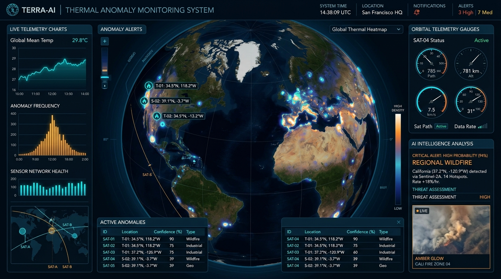
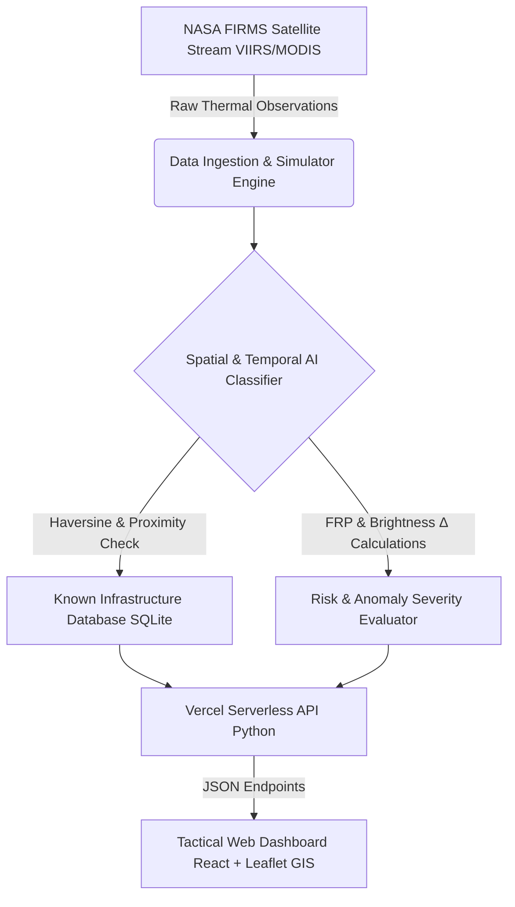

# 🔥 Thermal Hotspot AI — Orbital Intelligence Dashboard

<p align="center">
  
</p>

<p align="center">
  <b>A Full-Stack Satellite Thermal Anomaly & Wildfire Intelligence System</b><br>
  Powered by NASA FIRMS (VIIRS/MODIS), Spatial Persistence Algorithms, Infrastructure Proximity Mapping, and Multi-Class AI Anomaly Classification.
</p>

<p align="center">
  <a href="https://thermalguard-ai.vercel.app"></a>
</p>

<p align="center">
  <a href="https://python.org"></a>
  <a href="https://reactjs.org"></a>
  <a href="https://www.typescriptlang.org/"></a>
  <a href="https://tailwindcss.com"></a>
  <a href="https://thermalguard-ai.vercel.app"></a>
  <a href="LICENSE"></a>
</p>

---

## 🌐 Live Production Application

> 🔗 **Public Web App**: [https://thermalguard-ai.vercel.app](https://thermalguard-ai.vercel.app)  
> 📡 **Live API Status**: [https://thermalguard-ai.vercel.app/api/status](https://thermalguard-ai.vercel.app/api/status)

---

## ⚡ Core Capabilities & Highlights

| 🛰️ Orbital Intelligence & NASA Sync | 🤖 AI Classification Engine |
| :--- | :--- |
| • **Live Satellite Stream**: Integration with NASA FIRMS (VIIRS NRT & MODIS) thermal detection satellite feeds.<br>• **High-Fidelity Simulator**: Synthetic satellite pass stream generator for industrial clusters.<br>• **Telemetry Analytics**: Evaluates Fire Radiative Power ($FRP$), Brightness Temperatures ($TI_4 / TI_5$), and confidence. | • **Multi-Class Categorization**: Distinguishes *Industrial Fires, Gas Flaring, Wildfires, Agricultural Burning*, and *Mining Activity*.<br>• **Spatial & Temporal Clustering**: Uses Haversine distance, OSM proximity, and multi-pass persistence.<br>• **Explainable AI (XAI)**: Diagnostic reasoning chains for every anomaly signature. |

| 🗺️ Tactical GIS Web Dashboard | ⚡ Serverless & Production Architecture |
| :--- | :--- |
| • **Interactive Leaflet GIS Map**: Dynamic heatmaps, satellite imagery tiles, vector markers, and thermal pulse animations.<br>• **Midnight-Blue Cosmic UI**: High-density tactical interface designed for mission control.<br>• **Real-Time Signal Filtering**: Interactive category toggles, risk score sorting, FRP sliders, and search. | • **Vercel Cloud Deployment**: Zero-config deployment with serverless Python function endpoints.<br>• **SQLite Persistence Layer**: Embedded database storing thermal hotspots and facility geometries.<br>• **Vite Frontend Stack**: Fast compilation and optimized production bundle build. |

---

## 🏛️ System Architecture



---

## 🚀 Quickstart & Installation

### 1. Build Production Frontend
```bash
npm install
npm run build
```

### 2. Run Local Full-Stack Server
```bash
python main.py
```

### 3. Local Development Mode (Hot-Reloading)
```bash
# Terminal 1: Backend API (Port 8000)
python main.py

# Terminal 2: Frontend Dev Server (Port 3000)
npm run dev
```

---

## ⚙️ Environment Variables

Copy `.env.example` to `.env`:

```bash
cp .env.example .env
```

| Variable | Description | Default |
|---|---|---|
| `PORT` | Local server port for `main.py` | `8000` |
| `NASA_FIRMS_MAP_KEY` | NASA FIRMS MAP API Key for live satellite data | *(Simulation Mode)* |
| `DATABASE_URL` | SQLite database URI | `sqlite:///thermalguard.db` |

---

## 📡 REST API Reference

| Method | Endpoint | Description | Live Demo |
|---|---|---|---|
| `GET` | `/api/status` | System health check and connection status | [Try API](https://thermalguard-ai.vercel.app/api/status) |
| `GET` | `/api/hotspots` | Classified thermal hotspots (`?category=`, `?q=`, `?min_frp=`) | [Try API](https://thermalguard-ai.vercel.app/api/hotspots) |
| `GET` | `/api/stats` | Telemetry summary, FRP metrics, and classification distribution | [Try API](https://thermalguard-ai.vercel.app/api/stats) |
| `GET` | `/api/alerts` | Active high-risk anomaly alerts (Risk Score $\ge 61$) | [Try API](https://thermalguard-ai.vercel.app/api/alerts) |
| `GET` | `/api/national-risk` | State/Regional level thermal hazard aggregation | [Try API](https://thermalguard-ai.vercel.app/api/national-risk) |
| `GET` | `/api/facilities` | Database of known industrial, energy, and mining infrastructure | [Try API](https://thermalguard-ai.vercel.app/api/facilities) |
| `POST` | `/api/refresh` | Re-generate synthetic pass and re-run anomaly classifier | — |
| `POST` | `/api/sync-firms` | Trigger live synchronization with NASA FIRMS satellite servers | — |

---

## 📂 Repository Structure

| Path | Description |
|---|---|
| `src/components/` | Tactical GIS map, telemetry widgets, alert modals, and control panels |
| `src/services/` | FIRMS satellite API integration, AI classification logic & alert engine |
| `classifier.py` | Python spatial Haversine distance & temporal persistence engine |
| `firms_api.py` | NASA FIRMS API client with fallback simulation stream generator |
| `database.py` | SQLite database schema management and spatial queries |
| `api/index.py` | Vercel serverless function entry point for cloud deployment |
| `main.py` | Production HTTP server serving FastAPI endpoints & compiled static UI |

---

<p align="center">
  Built with ❤️ for Orbital Thermal Intelligence & Disaster Response • Deployed on <a href="https://thermalguard-ai.vercel.app">Vercel</a>
</p>
